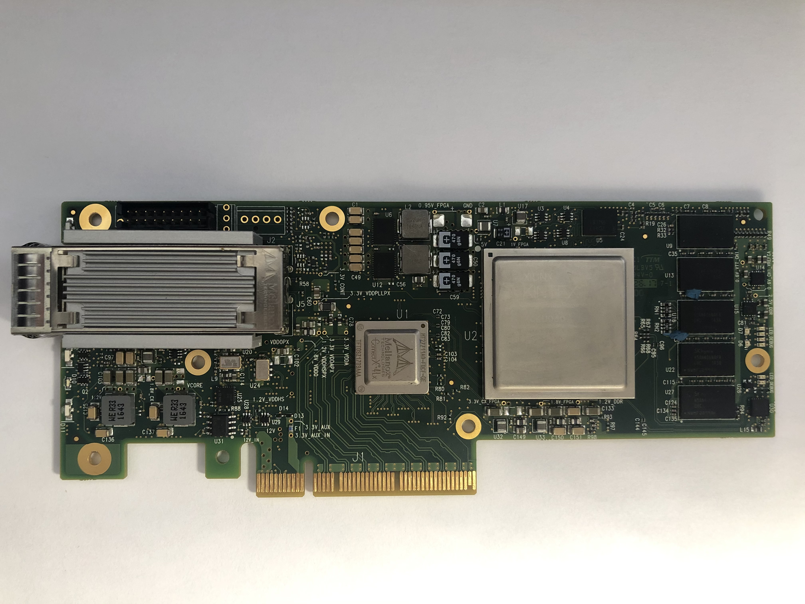
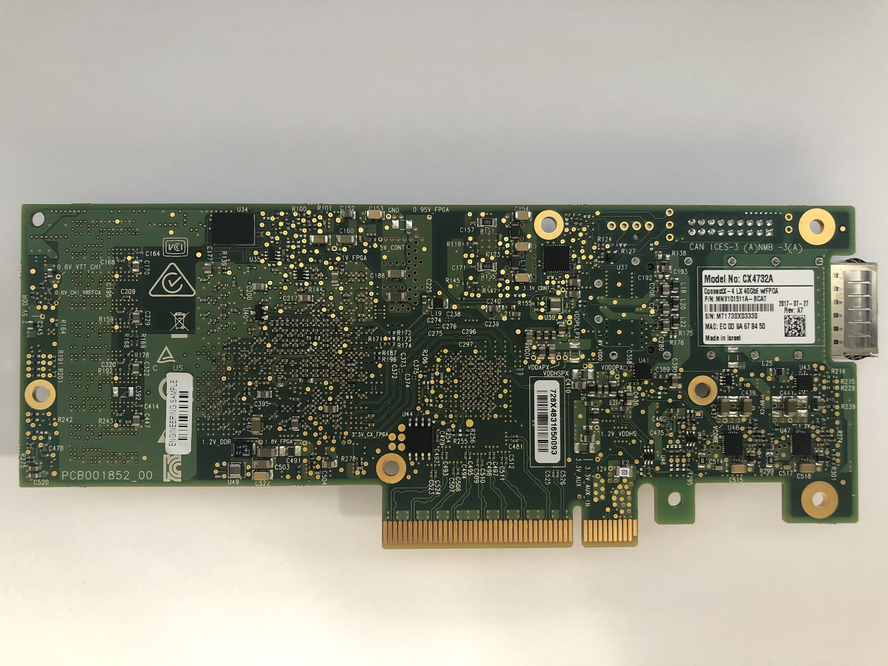
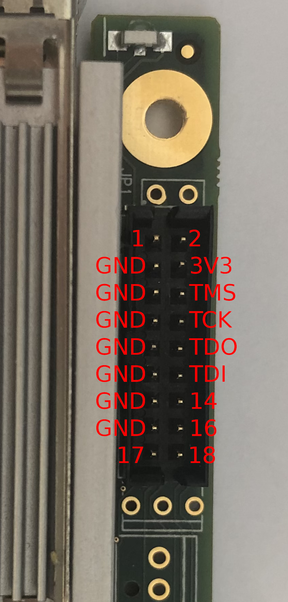

MNV101511A-BCAT Hardware Information
====================================

## Description

```
Innova Flex 4 Lx EN Adapter,
KU060, single-port QSFP,
10/40GbE, 2G, No Crypto,
PCIe3.0 x8, HHHL, passive
heat sink, tall bracket
```

## Label

```
Engineering Sample
PCB001852_00
Model No: CX4732A
ConnectX-4 LX 40GbE w/FPGA
2017-07-27
Rev: A7
P/N: MNV101511A-BCAT
```

## Front PCB Components



- U1: Mellanox Technologies ConnectX-4 Lx MT27711A0-FDCF-GE
- U2: Xilinx Kintex Ultrascale XCKU060 FFVA1156AAY1537 DF5289010A 2l
- U3: TI SN74LVC1G3157 5V; SPDT, 1-channel general-purpose analog switch (Marking:C55)
- U4: TI SN74LVC1G3157 5V; SPDT, 1-channel general-purpose analog switch (Marking:C55)
- U5: Micron MT25QL512ABB8E12-0SIT 512Mb SPI Flash (Micron FBGA:RW181)
- U6: TI CSD95490Q5MC 75A Synchronous Buck NexFET Power Stage (Marking:95490MC)
- U7: TI SN74LVC1G3157 5V; SPDT, 1-channel general-purpose analog switch (Marking:C55)
- U8: TI SN74LVC1G3157 5V; SPDT, 1-channel general-purpose analog switch (Marking:C55)
- U9: SK Hynix DDR4 256Mx16 H5AN4G6NAFR-UHC
- U12: TI CSD95490Q5MC 75A Synchronous Buck NexFET Power Stage (Marking:95490MC)
- U13: SK Hynix DDR4 256Mx16 H5AN4G6NAFR-UHC
- U14: TI TPS51200 3A Sink/Source DDR Termination Regulator w/ VTTREF Buffered Reference for DDRx (Marking:1200)
- U15: TI TPS73701DRBR 1A ultra-low-dropout voltage regulator with reverse current protection & enable (Marking:BZN)
- U16: SK Hynix DDR4 256Mx16 H5AN4G6NAFR-UHC
- U20: 100.00 MHz Crystal Oscillator (Marking:100.00 JB33 5E)
- U22: SK Hynix DDR4 256Mx16 H5AN4G6NAFR-UHC
- U24: Epson SG5032EAN PLL LVDS Crystal Oscillator (Marking:E 156.25G O VAN56UK)
- U25: ? (Marking:5933B 513) (QFN24)
- U26: N-channel enhancement mode MOSFET DMN63D8LW (Marking:MXX)
- U27: SK Hynix DDR4 256Mx16 H5AN4G6NAFR-UHC
- U28: TI SN74LVC1G3157 5V; SPDT, 1-channel general-purpose analog switch (Marking:C55)
- U29: TI SN74LVC1G3157 5V; SPDT, 1-channel general-purpose analog switch (Marking:C55)
- U30: ? (Marking:5933B 513) (QFN24)
- U31: Atmel ATMLH652 2DCM

## Back PCB Components



- U34: Micron MT25QL512ABB8E12-0SIT 512Mb SPI Flash (Micron FBGA:RW181)
- U35: TI SN74LVC1G3157 5V; SPDT, 1-channel general-purpose analog switch (Marking:C55)
- U36: TI SN74LVC1G3157 5V; SPDT, 1-channel general-purpose analog switch (Marking:C55)
- U37: PNP transistor ? (Marking:FR) (SOT23)
- U39: TI TPS53679 Dual-Channel D-CAP+ Step-Down Multiphase Controller with NVM and PMBus
- U40: TI REF1112 1uA 3-pin 10-ppm/Celcius shunt voltage reference (Marking:R11A)
- U41: TI TPS2557 0.5-5A adjustable current limit, 2.5-6.5V, 22mOhm USB power switch, active-high
- U43: NXP PCA6408ABS 8-bit I 2C-bus and SMBus I/O expander (Marking:P8A)
- U44: Winbond QSPI Flash 25Q128JVSQ
- U45: TI SN74LVC1G17 Single Schmitt-Trigger Buffer (Marking:C75)
- U46: TI TPS53915 1.5-18V, 12-A synchronous SWIFT buck converter with PMBus
- U47: TI TPS53915 1.5-18V, 12-A synchronous SWIFT buck converter with PMBus
- U48: TI SN74LVC1G3157 5V; SPDT, 1-channel general-purpose analog switch (Marking:C55)

## LEDs

| Label | FPGA LOC | Description |
| ----- | -------- | ----------- |
| D1    | N/C      | Physical/Logical link indicator |
| D2    | AF10     | User/Debug LED |
| D3    | AG10     | User/Debug LED |
| D3    | AG10     | User/Debug LED |
| D4    | AF9      | User/Debug LED |
| D5    | AG9      | User/Debug LED |
| D6    | AE8      | User/Debug LED |
| D7    | AF8      | User/Debug LED |
| D8    | AE10     | User/Debug LED |
| D9    | AD10     | User/Debug LED |
| D10   | N/C      | Power good |
| D11   | DONE_N7  | Configuration done |
| D12   | ?        | ? |

## JP3/JTAG Header

JP3 is a 2x9-pin 2mm pitch header for JTAG access to FPGA. Compatible with AMD/Xilinx HW-RIBBON14.



Pinout:

| Pin No. | Name | Pin No. | Name |
| ------- | ---- | ------- | ---- |
| 1       | ?    | 2       | ?    |
| 3       | GND  | 4       | 3V3  |
| 5       | GND  | 6       | TMS  |
| 7       | GND  | 8       | TCK  |
| 9       | GND  | 10      | TDO  |
| 11      | GND  | 12      | TDI  |
| 13      | GND  | 14      | ?    |
| 15      | GND  | 16      | ?    |
| 17      | SDA? | 18      | SCL? |

## PCIe

FPGA PCIe is routed through the ConnectX 4 Lx IC. It is currently unknown whether PCIe can be
routed to the PCIe edge connector. No public documents indicate that the ConnectX 4 Lx feature a
PCIe switch (like one available on Innova2's ConnectX 5).

## DDR4

There are 5 H5AN4G6NAFR-UHC DDR4 components: U9, U13, U16, U22, U27, where U16 uses only one of its
byte lanes. These 5 components make up the 9 byte lanes accessible to the FPGA.

### Address + Control

**WIP**

I/O Bank: 48

| Name    | FPGA LOC |
| ------- | -------- |
| ADR[0]  | AA29     |
| ADR[1]  | AG34     |
| ADR[2]  | AC31     |
| ADR[3]  | AD33     |
| ADR[4]  | Y30      |
| ADR[5]  | AB30     |
| ADR[6]  | AD34     |
| ADR[7]  | AB31     |
| ADR[8]  | AF33     |
| ADR[9]  | AG32     |
| ADR[10] | V33      |
| ADR[11] | AG31     |
| ADR[12] | AC34     |
| ADR[13] | AD30     |
| ADR[14] | AB34     |
| ADR[15] | W33      |
| ADR[16] | AC32     |
| BA[0]   | AE32     |
| BA[1]   | Y33      |
| BG[0]   | AC33     |
| CK_t    | Y31      |
| CK_c    | Y32      |
| CKE     | AA34     |
| CS_n    | V34      |
| ACT_n   | W30      |
| ODT     | V31      |
| PAR     | AD31     |
| RESET_n | AF32     |
| ALERT_n | AB29     |
| TEN     | ?        |

### U9 Byte Lanes

**WIP**

#### Lower Byte Lane

I/O Bank: 47

| Name   | FPGA LOC | FPGA Pin Name |
| ------ | -------- | ------------- |
| DML_n  | W23      | IO_L13P_T2L_N0_GC_QBC_47 |
| DQL[0] | T23      | IO_L17N_T2U_N9_AD10N_47 |
| DQL[1] | V21      | IO_L18P_T2U_N10_AD2P_47 |
| DQL[2] | T22      | IO_L17P_T2U_N8_AD10P_47 |
| DQL[3] | U21      | IO_L15P_T2L_N4_AD11P_47 |
| DQL[4] | Y25      | IO_L14N_T2L_N3_GC_47 |
| DQL[5] | W21      | IO_L18N_T2U_N11_AD2N_47 |
| DQL[6] | W25      | IO_L14P_T2L_N2_GC_47 |
| DQL[7] | U22      | IO_L15N_T2L_N5_AD11N_47 |
| DQSL_t | V22      | IO_L16P_T2U_N6_QBC_AD3P_47 |
| DQSL_c | V23      | IO_L16N_T2U_N7_QBC_AD3N_47 |

#### Upper Byte Lane

I/O Bank: 47

| Name   | FPGA LOC | FPGA Pin Name |
| ------ | -------- | ------------- |
| DMU_n  | AA22     | IO_L7P_T1L_N0_QBC_AD13P_47 |
| DQU[0] | Y23      | IO_L11P_T1U_N8_GC_47 |
| DQU[1] | AB20     | IO_L9N_T1L_N5_AD12N_47 |
| DQU[2] | AA23     | IO_L11N_T1U_N9_GC_47 |
| DQU[3] | AA20     | IO_L9P_T1L_N4_AD12P_47 |
| DQU[4] | AA25     | IO_L12N_T1U_N11_GC_47 |
| DQU[5] | AC22     | IO_L8P_T1L_N2_AD5P_47 |
| DQU[6] | AA24     | IO_L12P_T1U_N10_GC_47 |
| DQU[7] | AC23     | IO_L8N_T1L_N3_AD5N_47 |
| DQSL_t | AB21     | IO_L10P_T1U_N6_QBC_AD4P_47 |
| DQSL_c | AC21     | IO_L10N_T1U_N7_QBC_AD4N_47 |

### U13 Byte Lanes

**WIP**

#### Lower Byte Lane

I/O Bank: 48

| Name   | FPGA LOC | FPGA Pin Name |
| ------ | -------- | ------------- |
| DML_n  | AE27     | IO_L1P_T0L_N0_DBC_48 |
| DQL[0] | AF30     | IO_L6P_T0U_N10_AD6P_48 |
| DQL[1] | AC28     | IO_L3P_T0L_N4_AD15P_48 |
| DQL[2] | AE30     | IO_L5N_T0U_N9_AD14N_48 |
| DQL[3] | AD28     | IO_L3N_T0L_N5_AD15N_48 |
| DQL[4] | AG30     | IO_L6N_T0U_N11_AD6N_48 |
| DQL[5] | AF28     | IO_L2N_T0L_N3_48 |
| DQL[6] | AE28     | IO_L2P_T0L_N2_48 |
| DQL[7] | AD29     | IO_L5P_T0U_N8_AD14P_48 |
| DQSL_t | AF29     | IO_L4P_T0U_N6_DBC_AD7P_48 |
| DQSL_c | AG29     | IO_L4N_T0U_N7_DBC_AD7N_48 |

#### Upper Byte Lane

I/O Bank: 47

| Name   | FPGA LOC | FPGA Pin Name |
| ------ | -------- | ------------- |
| DMU_n  | V27      | IO_L19P_T3L_N0_DBC_AD9P_47 |
| DQU[0] | V29      | IO_L23P_T3U_N8_47 |
| DQU[1] | U25      | IO_L20N_T3L_N3_AD1N_47 |
| DQU[2] | W28      | IO_L21P_T3L_N4_AD8P_47 |
| DQU[3] | V26      | IO_L24P_T3U_N10_47 |
| DQU[4] | W29      | IO_L23N_T3U_N9_47 |
| DQU[5] | U24      | IO_L20P_T3L_N2_AD1P_47 |
| DQU[6] | W26      | IO_L24N_T3U_N11_47 |
| DQU[7] | Y28      | IO_L21N_T3L_N5_AD8N_47 |
| DQSL_t | U26      | IO_L22P_T3U_N6_DBC_AD0P_47 |
| DQSL_c | U27      | IO_L22N_T3U_N7_DBC_AD0N_47 |

### U16 Byte Lane

**WIP**

#### Lower Byte Lane

I/O Bank: 47

| Name   | FPGA LOC | FPGA Pin Name |
| ------ | -------- | ------------- |
| DML_n  | Y26      | IO_L1P_T0L_N0_DBC_47 |
| DQL[0] | AD26     | IO_L2N_T0L_N3_47 |
| DQL[1] | AB27     | IO_L5N_T0U_N9_AD14N_47 |
| DQL[2] | AD25     | IO_L2P_T0L_N2_47 |
| DQL[3] | AA27     | IO_L5P_T0U_N8_AD14P_47 |
| DQL[4] | AB25     | IO_L6P_T0U_N10_AD6P_47 |
| DQL[5] | AB26     | IO_L6N_T0U_N11_AD6N_47 |
| DQL[6] | AB24     | IO_L3P_T0L_N4_AD15P_47 |
| DQL[7] | AC24     | IO_L3N_T0L_N5_AD15N_47 |
| DQSL_t | AC26     | IO_L4P_T0U_N6_DBC_AD7P_47 |
| DQSL_c | AC27     | IO_L4N_T0U_N7_DBC_AD7N_47 |

### U22 Byte Lanes

**WIP**

#### Lower Byte Lane

I/O Bank: 46

| Name   | FPGA LOC | FPGA Pin Name |
| ------ | -------- | ------------- |
| DML_n  | AJ29     | IO_L13P_T2L_N0_GC_QBC_46 |
| DQL[0] | AJ31     | IO_L15N_T2L_N5_AD11N_46 |
| DQL[1] | AH34     | IO_L18P_T2U_N10_AD2P_46 |
| DQL[2] | AJ34     | IO_L18N_T2U_N11_AD2N_46 |
| DQL[3] | AH32     | IO_L17N_T2U_N9_AD10N_46 |
| DQL[4] | AK32     | IO_L14N_T2L_N3_GC_46 |
| DQL[5] | AH31     | IO_L17P_T2U_N8_AD10P_46 |
| DQL[6] | AJ30     | IO_L15P_T2L_N4_AD11P_46 |
| DQL[7] | AK31     | IO_L14P_T2L_N2_GC_46 |
| DQSL_t | AH33     | IO_L16P_T2U_N6_QBC_AD3P_46 |
| DQSL_c | AJ33     | IO_L16N_T2U_N7_QBC_AD3N_46 |

#### Upper Byte Lane

I/O Bank: 46

| Name   | FPGA LOC | FPGA Pin Name |
| ------ | -------- | ------------- |
| DMU_n  | AL32     | IO_L19P_T3L_N0_DBC_AD9P_46 |
| DQU[0] | AP33     | IO_L20N_T3L_N3_AD1N_46 |
| DQU[1] | AN33     | IO_L20P_T3L_N2_AD1P_46 |
| DQU[2] | AN31     | IO_L21P_T3L_N4_AD8P_46 |
| DQU[3] | AM34     | IO_L24N_T3U_N11_46 |
| DQU[4] | AP31     | IO_L21N_T3L_N5_AD8N_46 |
| DQU[5] | AL34     | IO_L24P_T3U_N10_46 |
| DQU[6] | AN32     | IO_L23N_T3U_N9_46 |
| DQU[7] | AM32     | IO_L23P_T3U_N8_46 |
| DQSL_t | AN34     | IO_L22P_T3U_N6_DBC_AD0P_46 |
| DQSL_c | AP34     | IO_L22N_T3U_N7_DBC_AD0N_46 |

### U27 Byte Lanes

**WIP**

#### Lower Byte Lane

I/O Bank: 46

| Name   | FPGA LOC | FPGA Pin Name |
| ------ | -------- | ------------- |
| DML_n  | AH26     | IO_L1P_T0L_N0_DBC_46 |
| DQL[0] | AK27     | IO_L3N_T0L_N5_AD15N_46 |
| DQL[1] | AK28     | IO_L6N_T0U_N11_AD6N_46 |
| DQL[2] | AM27     | IO_L2N_T0L_N3_46 |
| DQL[3] | AJ28     | IO_L6P_T0U_N10_AD6P_46 |
| DQL[4] | AM26     | IO_L2P_T0L_N2_46 |
| DQL[5] | AH27     | IO_L5P_T0U_N8_AD14P_46 |
| DQL[6] | AK26     | IO_L3P_T0L_N4_AD15P_46 |
| DQL[7] | AH28     | IO_L5N_T0U_N9_AD14N_46 |
| DQSL_t | AL27     | IO_L4P_T0U_N6_DBC_AD7P_46 |
| DQSL_c | AL28     | IO_L4N_T0U_N7_DBC_AD7N_46 |

#### Upper Byte Lane

I/O Bank: 46

| Name   | FPGA LOC | FPGA Pin Name |
| ------ | -------- | ------------- |
| DMU_n  | AN26     | IO_L7P_T1L_N0_QBC_AD13P_46 |
| DQU[0] | AP28     | IO_L8P_T1L_N2_AD5P_46 |
| DQU[1] | AL30     | IO_L12P_T1U_N10_GC_46 |
| DQU[2] | AN27     | IO_L9P_T1L_N4_AD12P_46 |
| DQU[3] | AP29     | IO_L8N_T1L_N3_AD5N_46 |
| DQU[4] | AM29     | IO_L11N_T1U_N9_GC_46 |
| DQU[5] | AM30     | IO_L12N_T1U_N11_GC_46 |
| DQU[6] | AL29     | IO_L11P_T1U_N8_GC_46 |
| DQU[7] | AN28     | IO_L9N_T1L_N5_AD12N_46 |
| DQSL_t | AN29     | IO_L10P_T1U_N6_QBC_AD4P_46 |
| DQSL_c | AP30     | IO_L10N_T1U_N7_QBC_AD4N_46 |

## Verbose lspci Output

```
# lspci -vv
...
01:00.0 Ethernet controller: Mellanox Technologies MT27710 Family [ConnectX-4 Lx]
        Subsystem: Mellanox Technologies MT27710 Family [ConnectX-4 Lx]
        Control: I/O- Mem+ BusMaster+ SpecCycle- MemWINV- VGASnoop- ParErr- Stepping- SERR- FastB2B- DisINTx+
        Status: Cap+ 66MHz- UDF- FastB2B- ParErr- DEVSEL=fast >TAbort- <TAbort- <MAbort- >SERR- <PERR- INTx-
        Latency: 0, Cache Line Size: 64 bytes
        Interrupt: pin A routed to IRQ 16
        Region 0: Memory at f0000000 (64-bit, prefetchable) [size=32M]
        Expansion ROM at f7d00000 [disabled] [size=1M]
        Capabilities: [60] Express (v2) Endpoint, MSI 00
                DevCap: MaxPayload 512 bytes, PhantFunc 0, Latency L0s unlimited, L1 unlimited
                        ExtTag+ AttnBtn- AttnInd- PwrInd- RBE+ FLReset+ SlotPowerLimit 75.000W
                DevCtl: CorrErr- NonFatalErr- FatalErr- UnsupReq-
                        RlxdOrd- ExtTag+ PhantFunc- AuxPwr- NoSnoop+ FLReset-
                        MaxPayload 128 bytes, MaxReadReq 512 bytes
                DevSta: CorrErr+ NonFatalErr- FatalErr- UnsupReq+ AuxPwr- TransPend-
                LnkCap: Port #0, Speed 8GT/s, Width x8, ASPM not supported
                        ClockPM- Surprise- LLActRep- BwNot- ASPMOptComp+
                LnkCtl: ASPM Disabled; RCB 64 bytes Disabled- CommClk+
                        ExtSynch- ClockPM- AutWidDis- BWInt- AutBWInt-
                LnkSta: Speed 8GT/s (ok), Width x8 (ok)
                        TrErr- Train- SlotClk+ DLActive- BWMgmt- ABWMgmt-
                DevCap2: Completion Timeout: Range ABCD, TimeoutDis+, NROPrPrP-, LTR-
                         10BitTagComp-, 10BitTagReq-, OBFF Not Supported, ExtFmt-, EETLPPrefix-
                         EmergencyPowerReduction Not Supported, EmergencyPowerReductionInit-
                         FRS-, TPHComp-, ExtTPHComp-
                         AtomicOpsCap: 32bit- 64bit- 128bitCAS-
                DevCtl2: Completion Timeout: 50us to 50ms, TimeoutDis-, LTR-, OBFF Disabled
                         AtomicOpsCtl: ReqEn-
                LnkCtl2: Target Link Speed: 8GT/s, EnterCompliance- SpeedDis-
                         Transmit Margin: Normal Operating Range, EnterModifiedCompliance- ComplianceSOS-
                         Compliance De-emphasis: -6dB
                LnkSta2: Current De-emphasis Level: -6dB, EqualizationComplete+, EqualizationPhase1+
                         EqualizationPhase2+, EqualizationPhase3+, LinkEqualizationRequest-
        Capabilities: [48] Vital Product Data
                Product Name: Innova Flex 4 Lx EN Adapter, KU060, single-port QSFP, 10/40GbE, PCIe3.0 x8, HHHL, tall bracket, ROHS R6
                Read-only fields:
                        [PN] Part number: MNV101511A-BCAT
                        [EC] Engineering changes: A7
                        [V2] Vendor specific: MNV101511A-BCAT
                        [SN] Serial number: MT1730X03330
                        [V3] Vendor specific: 06bd9b4fed7ae7118000ec0d9a67b450
                        [VA] Vendor specific: MLX:MODL=CX4732A:MN=MLNX:CSKU=V2:UUID=V3:PCI=0
                        [V0] Vendor specific: PCIeGen3 x8
                        [RV] Reserved: checksum good, 2 byte(s) reserved
                End
        Capabilities: [9c] MSI-X: Enable+ Count=64 Masked-
                Vector table: BAR=0 offset=00002000
                PBA: BAR=0 offset=00003000
        Capabilities: [c0] Vendor Specific Information: Len=18 <?>
        Capabilities: [40] Power Management version 3
                Flags: PMEClk- DSI- D1- D2- AuxCurrent=375mA PME(D0-,D1-,D2-,D3hot-,D3cold+)
                Status: D0 NoSoftRst+ PME-Enable- DSel=0 DScale=0 PME-
        Capabilities: [100 v1] Advanced Error Reporting
                UESta:  DLP- SDES- TLP- FCP- CmpltTO- CmpltAbrt- UnxCmplt- RxOF- MalfTLP- ECRC- UnsupReq- ACSViol-
                UEMsk:  DLP- SDES- TLP- FCP- CmpltTO- CmpltAbrt- UnxCmplt- RxOF- MalfTLP- ECRC- UnsupReq- ACSViol-
                UESvrt: DLP+ SDES- TLP- FCP+ CmpltTO- CmpltAbrt- UnxCmplt- RxOF+ MalfTLP+ ECRC- UnsupReq- ACSViol-
                CESta:  RxErr- BadTLP- BadDLLP- Rollover- Timeout- AdvNonFatalErr-
                CEMsk:  RxErr- BadTLP- BadDLLP- Rollover- Timeout- AdvNonFatalErr+
                AERCap: First Error Pointer: 04, ECRCGenCap+ ECRCGenEn- ECRCChkCap+ ECRCChkEn-
                        MultHdrRecCap- MultHdrRecEn- TLPPfxPres- HdrLogCap-
                HeaderLog: 00000000 00000000 00000000 00000000
        Capabilities: [150 v1] Alternative Routing-ID Interpretation (ARI)
                ARICap: MFVC- ACS-, Next Function: 0
                ARICtl: MFVC- ACS-, Function Group: 0
        Capabilities: [1c0 v1] Secondary PCI Express
                LnkCtl3: LnkEquIntrruptEn-, PerformEqu-
                LaneErrStat: 0
        Kernel driver in use: mlx5_core
        Kernel modules: mlx5_core
```

## Additional Information

- Product brief: https://web.archive.org/web/20230625041315/https://pdf4pro.com/amp/cdn/innova-flex-4-lx-en-adapter-card-compsource-com-4bb05c.pdf
- Innova IPsec User Manual: https://web.archive.org/web/20220412010534/https://network.nvidia.com/files/doc-2020/mellanox-innova-ipsec-ethernet-adapter-card-user-manual.pdf
