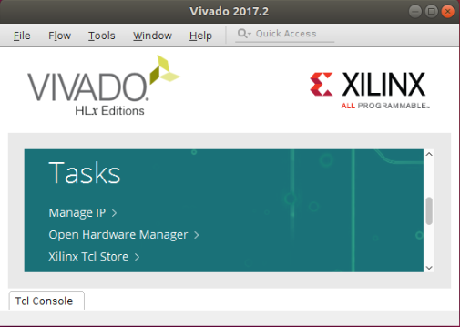
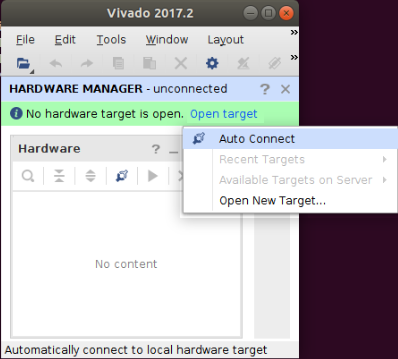
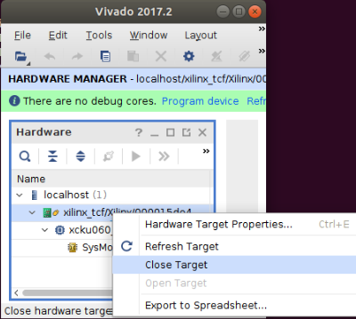
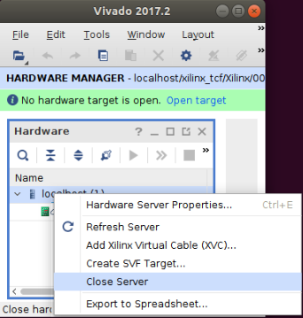

UrJTAG Setup and Usage Guide
============================

[UrJTAG](http://www.urjtag.org/) is a simple JTAG utility to send instructions, and get/set pins
from the command-line. In this guide, we will cover installation, part definition, basic usage,
and boundary scan annotation in conjunction with
[bscan_tools](https://github.com/tomverbeure/bscan_tools) from @tomverbeure.

Credits to @mwrnd, from whom I (@hansemro) ~~shamelessly stole~~ rewrote this from.

## Compiling and Installing UrJTAG

Install UrJTAG onto the development system (one with Vivado installed).

```bash
git clone https://git.code.sf.net/p/urjtag/git
cd urjtag/urjtag
./configure --prefix=/usr/local
make
sudo make install
```

## Xilinx Platform Cable (II) Compatibility

If `lsusb` detects the Xilinx Platform Cable JTAG adapter as `03fd:0013 Xilinx, Inc.`, then the
adapter needs its firmware updated by Vivado before it can work with UrJTAG's `xpc_ext` driver.

To do this via Vivado GUI, open the Hardware Manager:



Then open the JTAG adapter (this loads the firmware):



Lastly, close the adapter and hardware server, and then exit Vivado:





Alternatively, we can run the following command:

```bash
source /opt/Xilinx/Vivado/<version>/settings64.sh
printf "open_hw\nconnect_hw_server\ncurrent_hw_target [get_hw_targets */xilinx_tcf/Xilinx/*]\nopen_hw_target\ndisconnect_hw_server\nexit\n" | vivado -mode tcl
```

If successful, `lsusb` detects the adapter as `03fd:0008 Xilinx, Inc. Platform Cable USB II`.

## Checking Device ID

After specifying a valid jtag adapter with `cable <adapter>`, use the `detect` command to check
the 32-bit Device ID.

```bash
$ jtag
jtag> cable xpc_ext
firmware version = 0x0961 (2401)
cable CPLD version = 0xFFFE (65534)
jtag> detect
IR length: 6
Chain length: 1
Device Id: 00010011100100011001000010010011 (0x13919093)
  Manufacturer: Xilinx (0x093)
  Unknown part! (0011100100011001) (/usr/local/share/urjtag/xilinx/PARTS)
```

If `detect` warns of an unknown part, continue below where we add a new part definition. Note down
the first 4-bits of Device ID (the version/stepping) and the following 16-bits (the Part ID; also
specified after 'Unknown part').

## Identifying the FPGA in UrJTAG

### [Recommended] Option 1: Locating Path to Patched BSDL(s)

1. Obtain Kintex Ultrascale BSDLs from Vivado installation
(`$XILINX_VIVADO/data/parts/xilinx/kintexu/public/bsdl`) or from
[AMD/Xilinx downloads](https://www.xilinx.com/support/download/index.html/content/xilinx/en/downloadNav/device-models/bsdl-models/ultrascale-series-fpgas.html).

```bash
cp /opt/Xilinx/Vivado/<version>/data/parts/xilinx/kintexu/public/bsdl/xcku060_ffva1156.bsd .
```

2. Apply a urjtag bsd-support patch for the part:

```bash
patch -u xcku060_ffva1156.bsd ../jtag/xcku060_ffva1156.bsd.patch
```

3. Locate the directory containing the patched bsd with `bsdl path <path>`:

```
$ jtag
jtag> bsdl path /path/to/bsdl_directory/
jtag> detect
IR length: 6
Chain length: 1
Device Id: 00010011100100011001000010010011 (0x13919093)
  Filename:     /path/to/bsdl_directory/xcku060_ffva1156.bsd
```

### Option 2: Adding a New Part Definition to UrJTAG

UrJTAG does not provide definitions for any Kintex Ultrascale parts, so we will need to add them
to `/usr/local/share/urjtag/xilinx`.

1. Define XCKU060 FFVA1156 part by its Part ID:

```bash
sudo echo "# Kintex Ultrascale (XCKUxxx)" | sudo tee -a /usr/local/share/urjtag/xilinx/PARTS
sudo echo "0011100100011001 xcku060_ffva1156 xcku060_ffva1156" | sudo tee -a /usr/local/share/urjtag/xilinx/PARTS
```

2. Define a unique stepping for each 4-bit version/stepping pattern (the first 4-bits of Device ID):

```bash
sudo mkdir -p /usr/local/share/xilinx/urjtag/xilinx/xcku060_ffva1156
sudo echo "0000 xcku060_ffva1156 0" | sudo tee -a /usr/local/share/urjtag/xilinx/xcku060_ffva1156/STEPPINGS
sudo echo "0001 xcku060_ffva1156 1" | sudo tee -a /usr/local/share/urjtag/xilinx/xcku060_ffva1156/STEPPINGS
```

3. Copy the JTAG definition file (a file converted from Xilinx-provided BSDL file):

```bash
sudo cp ../jtag/xcku060_ffva1156.jtag /usr/local/share/urjtag/xilinx/xcku060_ffva1156/xcku060_ffva1156
```

If successful, the `detect` command will correctly identify the FPGA part:

```
jtag> detect
IR length: 6
Chain length: 1
Device Id: 00010011100100011001000010010011 (0x13919093)
  Manufacturer: Xilinx (0x093)
  Part(0):      xcku060_ffva1156 (0x3919)
  Stepping:     1
  Filename:     /usr/local/share/urjtag/xilinx/xcku060_ffva1156/xcku060_ffva1156
```

## Basics of UrJTAG

### Starting a JTAG Session

A UrJTAG session begins by specifying the JTAG adapter and detecting parts in the scan chain:

```
$ jtag
jtag> cable <jtag_adapter>
...
jtag> detect
IR length: 6
Chain length: 1
Device Id: 00010011100100011001000010010011 (0x13919093)
  Manufacturer: Xilinx (0x093)
  Part(0):      xcku060_ffva1156 (0x3919)
  Stepping:     1
  Filename:     /usr/local/share/urjtag/xilinx/xcku060_ffva1156/xcku060_ffva1156
```

To print the scan chain, run the `print chain` command:

```
jtag> print chain
 No. Manufacturer              Part                 Stepping Instruction          Register
-------------------------------------------------------------------------------------------------------------------
*  0 Xilinx                    xcku060_ffva1156     1        BYPASS               BYPASS
```

To select a part from the scan chain (if there are multiple parts), then run `part <index>` with
its index number in the chain. In our case, we only expect one part in the chain, so only `part 0`
is valid.

To see available commands, run the `help` command.

### Checking Toggling Pins in SAMPLE Mode with `scan` Command

With a part selected, run the `scan` command several times at some regular interval to capture
changes in state of all pins on a live FPGA. This is pretty useful for identifying toggling signals
such as (differential) clocks or flashing LEDs.

```
jtag> scan
IO_AA32: 0 > 1
IO_AB32: 1 > 0
IO_AE8: 0 > 1
IO_AG10: 1 > 0
IO_AN8: 1 > 0
IO_K20: 0 > 1
IO_Y31: 1 > 0
IO_Y32: 0 > 1
MGTHRXP0_224: 1 > 0
jtag> scan
IO_AA28: 0 > 1
IO_AC29: 0 > 1
IO_AG10: 0 > 1
IO_AG26: 0 > 1
IO_K20: 1 > 0
jtag> scan
IO_AA32: 1 > 0
IO_AB32: 0 > 1
IO_AK16: 0 > 1
IO_AK17: 1 > 0
IO_AN8: 0 > 1
IO_Y31: 0 > 1
IO_Y32: 1 > 0
```

### Getting/Setting Pins in EXTEST Mode

**Warning: writing to a pin externally driven to a different logic level may damage your
hardware!**

With a part selected, send the EXTEST instruction:

```
instruction EXTEST
shift ir
```

To check the status of a pin (sampled by the boundary scan register), run `get signal <pin_name>`.

For example, to check the state of pin IO_AG10, we run and can see the following:

```
jtag> get signal IO_AG10
IO_AG10 = 1
```

To set a pin high or low, run `set signal <pin_name> out <0|1>` followed by `shift dr`.

Sometimes an additional `shift dr` may be needed to detect changes to the output.

```
jtag> get signal IO_AG10
IO_AG10 = 1
jtag> set signal IO_AG10 out 0
jtag> shift dr
jtag> get signal IO_AG10
IO_AG10 = 1
jtag> shift dr
jtag> get signal IO_AG10
IO_AG10 = 0
```

### Capturing and Printing Boundary Scans in SAMPLE Mode

With a part selected, send the SAMPLE/PRELOAD instruction:

```
instruction SAMPLE/PRELOAD
shift ir
```

Sample the data passing through the boundary scan registers with `shift dr`, then print the capture
with `dr`:

```
jtag> shift dr
jtag> dr
1111111...1111101101101101101110110101101100 (0x00000...1B35FFFEDB6ED6C)
```

By repeatedly running `shift dr` and `dr` together, you can sample the state of the pins over some
interval of time and make observations. In a later section, we will use these two commands to
record data for analysis and pin annotation.

### Ending a JTAG Session

Set the boundary scan registers to BYPASS mode with `reset`, then `quit` to exit:

```
jtag> reset
jtag> quit
```

## Annotating Boundary Scan Captures With `bscan_tools`

@tomverbeure wrote [bscan_tools](https://github.com/tomverbeure/bscan_tools) which is a useful
utility for annotating JTAG boundary scan captures. We can use it to identify toggling pins and
determine pin directions. However, instead of OpenOCD, we can continue to use UrJTAG to sample
data.

### Setup

0. Install python 3.6 (newer versions raise errors).

1. Clone `bscan_tools`:

```bash
git clone https://github.com/tomverbeure/bscan_tools.git
```

2. Install tool dependencies with pip3.6:

```bash
pip3.6 install --user -r requirements.txt
```

3. Convert bsd(l) files to json format with bsdl2json:

```bash
bsdl2json /path/to/<bsd_file>.bsd -o <bsd_file>.bsd.json
```

Alternatively, you may copy an existing part json file from `../jtag/<part>_<package>.bsd.json`.

### Recording Boundary Scan Samples

To record several samples, we will leverage the following script to dump boundary scan captures in
hexadecimal to `./bscan_values.hex`. Make adjustments as necessary.

```bash
#!/usr/bin/env bash

SILENT=0
ADAPTER="xpc_ext"
NUM_SAMPLES=20
CACHED_DUMP_CMDS="./bscan_dump.jtag"
HEX_DUMP_FILE="./bscan_values.hex"

if [ $NUM_SAMPLES -lt 1 ]; then
    echo "Error: NUM_SAMPLES must be greater than 0"
    exit 1
fi

if [ ! -f $CACHED_DUMP_CMDS ] || [ $(wc -l $CACHED_DUMP_CMDS | cut -d' ' -f1) -ne $(((NUM_SAMPLES - 1) * 2 + 7)) ]; then
    test $SILENT -eq 0 && echo "Generating $CACHED_DUMP_CMDS with $NUM_SAMPLES sample capture(s)"
    printf "cable $ADAPTER\ndetect\n" > $CACHED_DUMP_CMDS
    printf "instruction SAMPLE/PRELOAD\nshift ir\n" >> $CACHED_DUMP_CMDS
    printf "dr\n" >> $CACHED_DUMP_CMDS
    for i in $(seq 2 $NUM_SAMPLES); do
        printf "shift dr\ndr\n" >> $CACHED_DUMP_CMDS
    done
    printf "reset\nquit\n" >> $CACHED_DUMP_CMDS
fi

if [ $SILENT -eq 0 ] && [ -f $HEX_DUMP_FILE ]; then
    echo "$HEX_DUMP_FILE exists and will be overwritten..."
    rm -f $HEX_DUMP_FILE
fi

# TODO: check cable status
# TODO: check part status

test $SILENT -eq 0 && echo "Recording boundary scan captures to $HEX_DUMP_FILE"
# Note: UrJTAG HEX output is incorrect, so we will need to convert the binary string ourselves
BIN_DR_LINES=$(jtag $CACHED_DUMP_CMDS | grep -Eo '^[0-1]+')
for BIN_LINE in ${BIN_DR_LINES[@]}; do
    # remove line breaks from bc with read
    read HEX <<< $(echo "obase=16; ibase=2; $BIN_LINE" | bc)
    echo $HEX >> $HEX_DUMP_FILE
done
```

### Annotating Boundary Scan Samples

We can process the recorded samples (`bscan_values.hex`) with the `bscan_proc.py` script
(first without annotations):

```bash
python3.6 bscan_proc.py /path/to/xcku060_ffva1156.bsd.json ./bscan_values.hex > ./pin_report.txt
```

Opening `pin_report.txt` in a text editor, we can more efficiently analyze pins.

```
AA9   (CCLK_AA9)          : OUTPUT3   :  1 1 1 1 1 1 1 1 1 1 1 1 1 1 1 1 1 1 1 1
AA9   (CCLK_AA9)          : CONTROLR  :  0 0 0 0 0 0 0 0 0 0 0 0 0 0 0 0 0 0 0 0
AA9   (CCLK_AA9)          : INPUT     :  1 1 1 1 1 1 1 1 1 1 1 1 1 1 1 1 1 1 1 1

W7    (CFGBVS_W7)         : INPUT     :  1 1 1 1 1 1 1 1 1 1 1 1 1 1 1 1 1 1 1 1

AC7   (D00_MOSI_AC7)      : OUTPUT3   :  0 0 0 0 0 0 0 0 0 0 0 0 0 0 0 0 0 0 0 0
AC7   (D00_MOSI_AC7)      : CONTROLR  :  1 1 1 1 1 1 1 1 1 1 1 1 1 1 1 1 1 1 1 1
AC7   (D00_MOSI_AC7)      : INPUT     :  1 1 1 1 1 1 1 1 1 1 1 1 1 1 1 1 1 1 1 1
...
AG10  (IO_AG10)           : OUTPUT3   :  1 0 0 0 0 0 0 0 0 0 0 1 1 1 1 1 1 1 1 1 !
AG10  (IO_AG10)           : CONTROLR  :  0 0 0 0 0 0 0 0 0 0 0 0 0 0 0 0 0 0 0 0
AG10  (IO_AG10)           : INPUT     :  1 0 0 0 0 0 0 0 0 0 0 1 1 1 1 1 1 1 1 1 !
...
AK16  (IO_AK16)           : OUTPUT3   :  0 0 0 0 0 0 0 0 0 0 0 0 0 0 0 0 0 0 0 0
AK16  (IO_AK16)           : CONTROLR  :  1 1 1 1 1 1 1 1 1 1 1 1 1 1 1 1 1 1 1 1
AK16  (IO_AK16)           : INPUT     :  0 0 0 1 0 0 0 1 1 1 0 1 0 0 1 1 1 0 1 1 !

AK17  (IO_AK17)           : OUTPUT3   :  0 0 0 0 0 0 0 0 0 0 0 0 0 0 0 0 0 0 0 0
AK17  (IO_AK17)           : CONTROLR  :  1 1 1 1 1 1 1 1 1 1 1 1 1 1 1 1 1 1 1 1
AK17  (IO_AK17)           : INPUT     :  1 1 1 0 1 1 1 0 0 0 1 0 1 1 0 1 0 1 0 0 !
...
```

In the snippet above, we can identify the following:

- AA9 is configured as an output pin
    - where CONTROLR = 0
- AC7 is configured as an input pin
    - where CONTROLR = 1
- `!` indicate toggling pins on AG10, AK16, and AK17
    - Since AG10 is an output, drive it high/low in EXTEST mode to observe how the system responds
        - Setting AG10 low powers on LED D3
        - Setting AG10 high powers off LED D3
    - AK17 and AK16 are differential clock inputs
        - I/O Planning View in Vivado confirms these are differential pairs and can be a global
          clock source
        - We can confirm this is a valid differential clock pair by creating a blinky demo.

After analyzing some pins, we can label them in an annotation file (`pin_renamings.txt`).

Following our example, our annotation file `pin_renamings.txt` looks like the following:

```
AG10:D3_LED_N
AK17:DIFF_CLK_0_P
AK16:DIFF_CLK_0_N
```

Reprocess the recorded samples with the `-r <pin_renamings.txt>` argument:

```bash
python3.6 bscan_proc.py -r ./pin_renamings.txt /path/to/xcku060_ffva1156.bsd.json ./bscan_values.hex > ./pin_report.txt
```

Now we should see the labels assigned to the pins:

```
...
AG10  (D3_LED_N)          : OUTPUT3   :  1 0 0 0 0 0 0 0 0 0 0 1 1 1 1 1 1 1 1 1 !
AG10  (D3_LED_N)          : CONTROLR  :  0 0 0 0 0 0 0 0 0 0 0 0 0 0 0 0 0 0 0 0
AG10  (D3_LED_N)          : INPUT     :  1 0 0 0 0 0 0 0 0 0 0 1 1 1 1 1 1 1 1 1 !

AK16  (DIFF_CLK_0_N)      : OUTPUT3   :  0 0 0 0 0 0 0 0 0 0 0 0 0 0 0 0 0 0 0 0
AK16  (DIFF_CLK_0_N)      : CONTROLR  :  1 1 1 1 1 1 1 1 1 1 1 1 1 1 1 1 1 1 1 1
AK16  (DIFF_CLK_0_N)      : INPUT     :  0 0 0 1 0 0 0 1 1 1 0 1 0 0 1 1 1 0 1 1 !

AK17  (DIFF_CLK_0_P)      : OUTPUT3   :  0 0 0 0 0 0 0 0 0 0 0 0 0 0 0 0 0 0 0 0
AK17  (DIFF_CLK_0_P)      : CONTROLR  :  1 1 1 1 1 1 1 1 1 1 1 1 1 1 1 1 1 1 1 1
AK17  (DIFF_CLK_0_P)      : INPUT     :  1 1 1 0 1 1 1 0 0 0 1 0 1 1 0 1 0 1 0 0 !
...
```

## Credits

- [mwrnd](https://github.com/mwrnd)
- [Tom Verbeure](https://github.com/tomverbeure)
